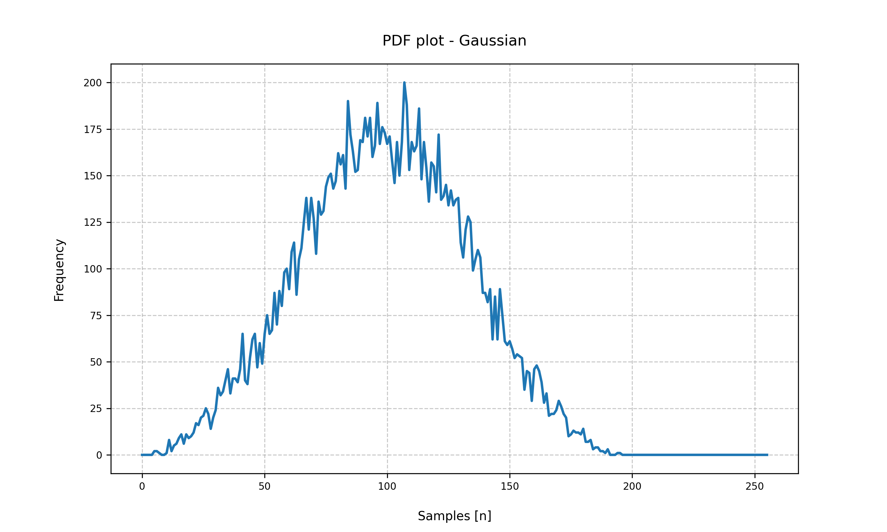
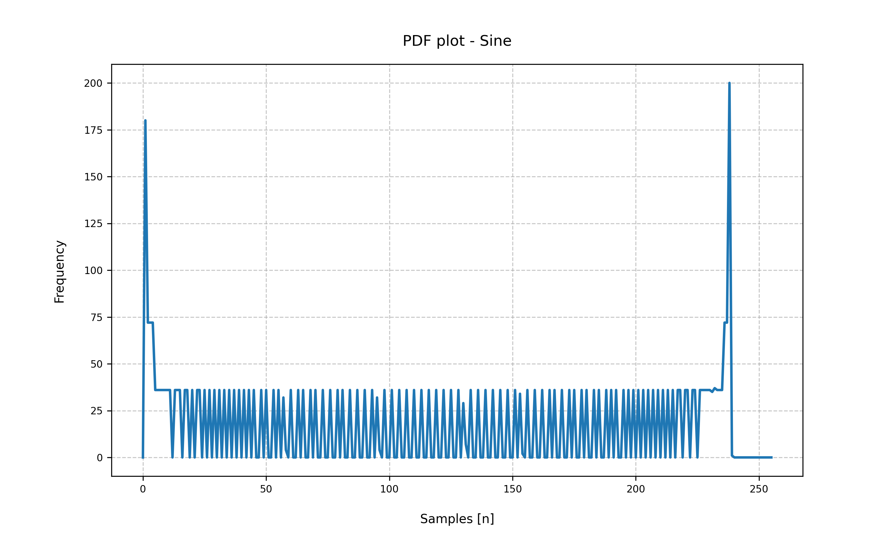
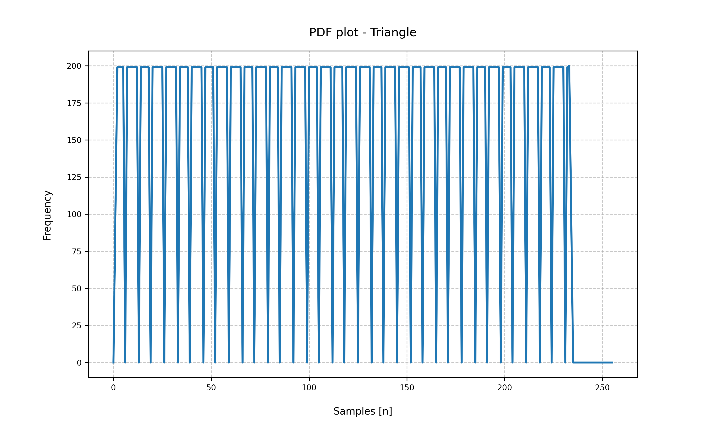
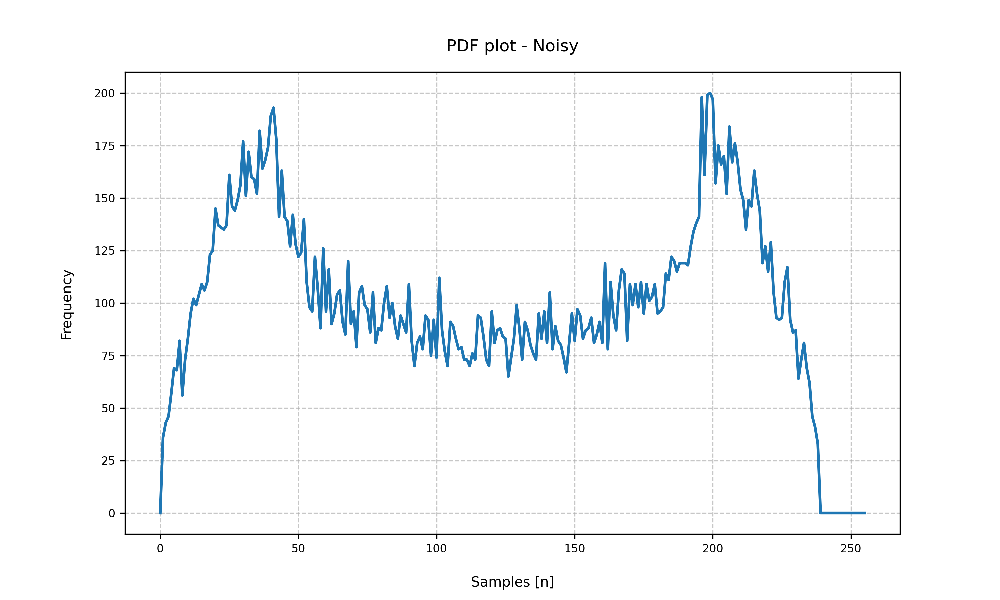

# RISC-V RV32I Processor

## Team 24 Statement

| Kevin Lau (repo manager) | William Huynh | James Mitchell | Noam Weitzman |
|-|-|-|-|

## Final submission

Our team has successfully completed and verified the following for our RV32I 
  processor:

| Tag                                                            | Description  | Statement |
| -------------------------------------------------------------- |------------- |-----------|
| [v0.1.0](https://github.com/booth-algo/RISC-V-T24/tree/v0.1.0) | Lab4         | [lab4.md](./docs/team_statement_sections/lab4.md) | 
| [v0.2.0](https://github.com/booth-algo/RISC-V-T24/tree/v0.2.0) | Single-Cycle | [single_cycle.md](./docs/team_statement_sections/single_cycle.md) |
| [v0.3.0](https://github.com/booth-algo/RISC-V-T24/tree/v0.3.0) | Pipelined    | [pipeline.md](./docs/team_statement_sections/pipeline.md) |
| [v0.4.0](https://github.com/booth-algo/RISC-V-T24/tree/v0.4.0) | Direct-mapped Cache | [cache.md](./docs/team_statement_sections/cache.md) |

#### Important Notes ####
- We are especially proud of our `testbench`, which has been a major contributor 
  to our test-driven development for this project -- please take the time to 
  read [testing.md](docs/team_statement_sections/testing.md), which highlights 
  important features such as CI, code coverage, data analysis, etc.
- Implemented but unverified: `Two-way set associative cache`

## Personal statements

| Member    | Personal statement | Logbook |
|-----------|--------------------|---------|
| Kevin     | [Personal statement](docs/personal_statements/kevin_statement.md) | [Logbook](docs/logbooks/kevin_log.md) |
| William   | [Personal statement](docs/personal_statements/william_statement.md) | [Logbook](docs/logbooks/william_log.md) |
| Jamie     | [Personal statement](docs/personal_statements/james_statement.md) | [Logbook](docs/logbooks/james_log.md) |
| Noam      | [Personal statement](docs/personal_statements/noam_statement.md) | [Logbook](docs/logbooks/noam_log.md) |


## Quick Start

Note: before running **ANY** script (including the first time script), execute this 
command.

```bash
cd tb
```

### First Time

If you are using this for the first time, you need to install dependencies.

```bash
./install.sh
```

### Using the testbench

There are two main scripts: `doit.sh` and `analyse.py`. More documentation, 
including developer/maintainer documentation is available 
[here](docs/references/instructions.md).

Here are the relevant commands. More can be found in the documentation.

| Command                               | Explanation                           |
| ------------------------------------- |-------------------------------------- |
| `./doit.sh`                           | Runs the entire testbench.            |
| `./doit.sh test/top-instr_tb.cpp`     | Runs the entire instruction testbench |
| `./doit.sh test/top-pdf_tb.cpp`       | Runs the PDF testbench* (stdout)      |
| `./doit.sh test/top-pdf_TB.cpp`       | Runs the PDF testbench* (vBuddy)      |
| `./doit.sh test/top-f1lights_tb.cpp`  | Runs the F1 lights testbench (stdout) |
| `./doit.sh test/top-f1lights_TB.cpp`  | Runs the F1 lights testbench (vBuddy) |
| `./analyse.py demo`                   | Creates PDF graphs of all reference data

\* Note: to run the PDF testbench, you need to load the data memory. 
Run only ONE of the following commands BEFORE `doit.sh`.

Gaussian:

```bash
cp data/gaussian.mem ../rtl/data.hex
```

Noisy:

```bash
cp data/noisy.mem ../rtl/data.hex
```

Sine:

```bash
cp data/sine.mem ../rtl/data.hex
```

Triangle:

```bash
cp data/triangle.mem ../rtl/data.hex
```

To use vBuddy, refer to WSL documentation. You may find this command useful:

```bash
# Must be ttyUSB0 - otherwise find and replace in vbuddy.cpp
sudo chmod a+rw /dev/ttyUSB0
```

## Team Workflow

### Repo management (using `git`)

- The functions of `git` were fully utilised in this project
- `Branches` were created for implementations of different features to avoid 
  conflict and pushing faulty / poorly written code to `main`
- `Tags` were created for each completed version of the RV32I processor

### Repo organisation 

- [`docs`](docs/): logbooks, statements, references
- [`images`](images/): images for [`docs`](docs/)
- [`rtl`](rtl/): RV32I processor modules
- [`tb`](tb/): Testbench and scripts

### Workflow

- After `lab4`, modules / work were dynamically allocated to team members
- Team meetings, discussion and progress are logged in 
[`team_log.md`](docs/logbooks/team_log.md)
- All personal contributions and progress (such as debugging notes) are noted 
  down in personal logbooks in [`docs/logbooks`](docs/logbooks/)

## Working Evidence

Note: The following evidence was collected from running `tag v0.4.0`, the 
`direct-mapped cache` version of our code.

- If you want to check our [`testbenches`](tb/) or plot the `graphs` below, 
  please refer to the [Quick Start](#quick-start) section above, where all 
  instructions are available.

### Graphs
| Dataset | Graph | Dataset | Graph |
|-|-|-|-|
| Gaussian |  | Sine |  |
| Triangle |  | Noisy |  |

### Videos

F1 lights

https://github.com/booth-algo/RISC-V-T24/assets/107279223/7ba429f9-0615-4acf-bf2c-6efdae65fc95

Gaussian

https://github.com/booth-algo/RISC-V-T24/assets/107279223/ae81e89a-4829-4060-a14d-17d87582065d

Sine

https://github.com/booth-algo/RISC-V-T24/assets/107279223/a9c6b198-6e7f-49ab-9ae8-99291412456b

Triangle

https://github.com/booth-algo/RISC-V-T24/assets/107279223/46700d7b-6817-48e7-a547-8d06d6d3c28a

Noisy

https://github.com/booth-algo/RISC-V-T24/assets/107279223/bfe780a5-3d4b-4b68-b6db-5aa5694de6ce


## Team Contribution

- Work Contribution Table
- `*` (one star) refers to **minor contribution**
- `**` (two stars) refers to **major contribution**

|              |                               | Kevin (booth-algo) | Will (saturn691) | Jamie (jamiemitchell123) | Noam (noamweitz) |
| ------------ | ----------------------------- | ------------------ | ---------------- | ------------------------ | ---------------- |
| Lab 4        | Program Counter               | **                 |                  |                          |                  |
|              | ALU                           |                    |                  | **                       |                  |
|              | Register File                 |                    |                  | **                       |                  |
|              | Instruction Memory            |                    |                  |                          | **               |
|              | Control Unit                  |                    |                  |                          | **               |
|              | Sign Extend                   |                    |                  |                          | **               |
|              | Testbench                     |                    | **               |                          |                  |
| Single Cycle | Data Memory                   | **                 |                  | **                       | *                |
|              | Program Counter (refactor)    |                    | **               |                          |                  |
|              | ALU (refactor)                |                    | **               |                          | **               |
|              | Register File (refactor)      |                    |                  | **                       |                  |
|              | Instruction Memory (refactor) | **                 | *                |                          |                  |
|              | Control Unit (refactor)       | *                  | **               | *                        | **               |
|              | Sign Extend (refactor)        |                    | **               |                          | *                |
| Pipeline     | Pipeline flip-flop stages     | **                 | *                |                          |                  |
|              | Hazard unit                   | **                 | **               |                          |                  |
| Cache        | Memory (refactor)             | *                  | **               |                          |                  |
|              | Direct mapped cache           | **                 | **               | **                       | **               |
|              | Two-way set associative cache | **                 | **               | **                       | **               |

As a team, we all agree that the above table and commits do not accurately 
measure the contribution of team members due to the following reasons:

  1. When working together in Room 404 / calling on Discord (online), we would 
  operate on only one of the laptops, so some commits made by team members are 
  often a combined effort of two or more members, while the other laptop might 
  be on another version / tag for testing and debugging.

  2. The effort revolving around debugging is often highly overlooked - commits 
  with simple fixes often took hours / days of effort from two or more members 
  to debug a small mistake.

  3. Testbench building and writing played a huge role in streamlining our 
  process, and multiple tests were written to specifically do debugging and 
  isolate problematic parts / instructions.

As such, it is highly recommended that readers refer to all of the 
[`logbooks`](docs/logbooks/), [`personal statements`](docs/personal_statements/), 
and `commits`, to accurately evaluate the amount of work, effort and contribution 
of each member.