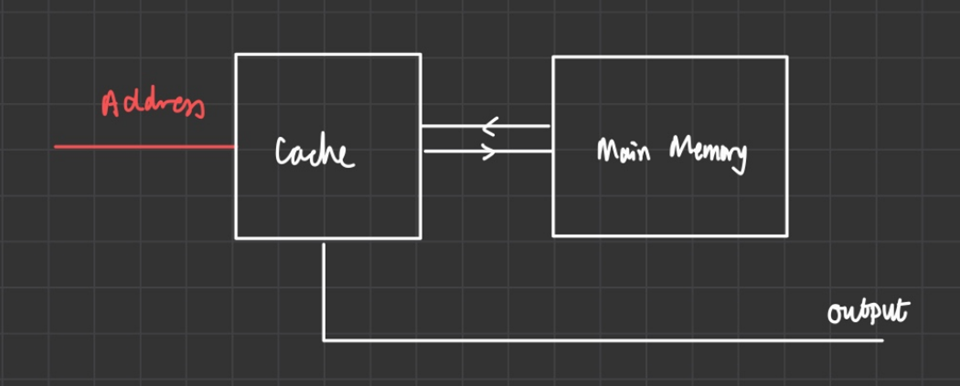

# RISC-V Team 24 Statement

## Team 24
| Kevin Lau (repo manager) | William Huynh | James Mitchell | Noam Weitzman |
|-|-|-|-|


## Quick Start

Note: before running **ANY** script (including the first time script), execute this 
command.

```bash
cd tb
```

### First Time

If you are using this for the first time, you need to install dependencies.

```bash
./install.sh
```

### Using the testbench

There are two main scripts: `doit.sh` and `analyse.py`. More documentation, 
including developer/maintainer documentation is available 
[here](docs/references/instructions.md).

Here are the relevant commands. More can be found in the documentation.

| Command                               | Explanation                           |
| ------------------------------------- |-------------------------------------- |
| `./doit.sh`                           | Runs the entire testbench.            |
| `./doit.sh test/top-instr_tb.cpp`     | Runs the entire instruction testbench |
| `./doit.sh test/top-pdf_tb.cpp`       | Runs the PDF testbench (stdout)       |
| `./doit.sh test/top-pdf_TB.cpp`       | Runs the PDF testbench (vBuddy)       |
| `./doit.sh test/top-f1lights_tb.cpp`  | Runs the F1 lights testbench (stdout) |
| `./doit.sh test/top-f1lights_TB.cpp`  | Runs the F1 lights testbench (vBuddy) |
| `./analyse.py demo`                   | Creates PDF graphs of all reference data

To use vBuddy, refer to WSL documentation. You may find this command useful:

```bash
# Must be ttyUSB0- otherwise find and replace in vbuddy.cpp
sudo chmod a+rw /dev/ttyUSB0
```

## Final submission

Our team has successfully completed and verified the following for our RV32I 
  processor:

| Tag                                                            | Description  |
| -------------------------------------------------------------- |------------- |
| [v0.1.0](https://github.com/booth-algo/RISC-V-T24/tree/v0.1.0) | Lab4         |
| [v0.2.0](https://github.com/booth-algo/RISC-V-T24/tree/v0.2.0) | Single-Cycle |
| [v0.3.0](https://github.com/booth-algo/RISC-V-T24/tree/v0.3.0) | Pipelined    |
| [v0.4.0](https://github.com/booth-algo/RISC-V-T24/tree/v0.4.0) | Direct-mapped Cache


Implemented but unverified: two-way set associative cache

## Team Contribution
- Work Contribution Table
- `*` (one star) refers to **partial / minor contribution**
- `**` (two stars) refers to **full / major contribution**

|              |                               | Kevin (booth-algo) | Will (saturn691) | Jamie (jamiemitchell123) | Noam (noamweitz) |
| ------------ | ----------------------------- | ------------------ | ---------------- | ------------------------ | ---------------- |
| Lab 4        | Program Counter               | **                 |                  |                          |                  |
|              | ALU                           |                    |                  | **                       |                  |
|              | Register File                 |                    |                  | **                       |                  |
|              | Instruction Memory            |                    |                  |                          | **               |
|              | Control Unit                  |                    |                  |                          | **               |
|              | Sign Extend                   |                    |                  |                          | **               |
|              | Testbench                     |                    | **               |                          |                  |
| Single Cycle | Data Memory                   | **                 |                  | **                       | *                |
|              | Program Counter (refactor)    |                    | **               |                          |                  |
|              | ALU (refactor)                |                    | **               |                          | **               |
|              | Register File (refactor)      |                    |                  | **                       |                  |
|              | Instruction Memory (refactor) | **                 | *                |                          |                  |
|              | Control Unit (refactor)       | *                  | **               | *                        | **               |
|              | Sign Extend (refactor)        |                    | **               |                          | *                |
| Pipeline     | Pipeline flip-flop stages     | **                 | *                |                          |                  |
|              | Hazard unit                   | **                 | **               |                          |                  |
| Cache        | Memory (refactor)             |                    | **               |                          |                  |
|              | Direct mapped cache           | **                 | **               | **                       | **               |
|              | Two-way set associative cache | *                  |                  | **                       | **               |

As a team, we all agree that both the list and GitHub commits do not accurately measure the contribution of team members due to the following reasons:

  1. When working together in Room 404 / calling on Discord (online), we would operate on only one of the laptops, so some commits made by team members are often a combined effort of two or more members, while the other laptop might be on another version / tag for testing and debugging
  2. The effort revolving around debugging is often highly overlooked - commits with simple fixes often took hours / days of effort from more than one member to debug a small mistake
  3. Testbench building and writing played a huge role in streamlining our process, and multiple tests were written to specifically do debugging and isolate problematic parts / instructions

As such, it is highly recommended that readers refer to all of the `logbooks`, `personal statements`, and `commits`, to accurately evaluate the amount of work, effort and contribution of each member

## Team Workflow
### Repo management (using `git`)
- The functions of `git` were fully utilised in this project
- `Branches` were created for implementations of different features to avoid conflict and pushing faulty / poorly written code to `main`
- `Tags` were created for each completed version of the RV32I processor
### Repo organisation 
- `docs`: logbooks, statements, references
- `images`: images for `docs`
- `rtl`: RV32I processor modules
- `tb`: Testbench and scripts
### Workflow
- After `lab4`, modules / work were dynamically allocated to team members
- Team meetings, discussion and progress are logged in `team_log.md`
- All personal contributions and progress (such as debugging notes) are noted down in personal logbooks in `docs/logbooks`

## Working Evidence
### Graphs
| Dataset | Graph | Dataset | Graph |
|-|-|-|-|
| Gaussian |  | Sine |  |
| Triangle |  | Noisy | / |

### Videos

F1 lights

https://github.com/booth-algo/RISC-V-T24/assets/107279223/7ba429f9-0615-4acf-bf2c-6efdae65fc95

Gaussian

https://github.com/booth-algo/RISC-V-T24/assets/107279223/ae81e89a-4829-4060-a14d-17d87582065d

Sine

https://github.com/booth-algo/RISC-V-T24/assets/107279223/a9c6b198-6e7f-49ab-9ae8-99291412456b

Triangle

https://github.com/booth-algo/RISC-V-T24/assets/107279223/46700d7b-6817-48e7-a547-8d06d6d3c28a

Noisy

https://github.com/booth-algo/RISC-V-T24/assets/107279223/bfe780a5-3d4b-4b68-b6db-5aa5694de6ce

## Content // Need to link to each section
1. Lab 4
2. Single Cycle Version
3. Pipelined Version
4. Cached Version
   - Direct-mapped
   - Two-way set associative

## Lab 4 (v0.1.0)
- 

## Single Cycle Version


## Pipeline Version


## Cached Version


### Introduction

In computer architecture, memory performance plays a pivotal role in computer performance, but has been lagging behind processor performance. To mitigate this, memory hierarchy is introduced:


 
Cache memory is the fastest type of memory accessible from the processor but has limited storage and is more expensive. Cache memory will be used to store data likely to be used again, whether because it was used recently or because nearby data was used recently; properties referred to as temporal and spatial locality. Ideally, cache would supply most data to the processor, as accessing main memory is a less attractive option. 

Memory performance is defined using **HIT** and **MISS** attributes, where the wanted data is either in the actual level of memory hierarchy (**HIT**) or not (**MISS**). Hence, the Average Memory Access Time (**AMAT**) depends on the access time to different layers of memory, and the miss rates associated with those layers.

Cache memory is stored in sets, where each memory address maps to exactly one cache set, and each set having **N** blocks (with N being the **degree of associativity** of the cache). Direct mapped cache refers to 1-set associativity, so each set holds a unique block. Although direct mapped cache improves memory performance, it will encounter issues as many memory addresses map to the same set, resulting in conflict.

In response, a two-way set associative cache is introduced, offering a solution by allowing each set to host two distinct data blocks from two members of the set. In the course of this project, the implementation of a direct-mapped cache has proven successful and aligns with expectations. However, the two-way set associative cache, while implemented, presents challenges and does not operate seamlessly.

### Design Specifications

To improve the design of the CPU which retrieves data from the data memory, a cache was designed to increase the speed of retrieving information. In the original design of the memory, the data memory contained input signals, **Address** and **WriteData** and **ReadData** as the output signal, as shown below. 


Retrieving data from memory took approximately 1000 clock cycles, hindering the time needed to complete instructions. **##** To improve this, a cache design was implemented using the following schematic:


In this design, the **Address** signal is inputted to both the direct mapped cache and the data memory. If the address #insert signal# is mapped to one of the sets of data, the output signal **MISS** is set to low, and the data is read out of the cache through the multiplexer. If the **Address** signal does not map to a cache set, the output signal **MISS** = 1, and the output is read through the multiplexer but the technical aspect of this will be explored later.

However, with this implementation, an error, later discovered during implementation, occurred upon writing data from the **DATA MEMORY** to the **CACHE** due to misalignment of clock cycles. A new high-level configuration was required for the memory block. A more concise design was implemented, removing the multiplexer, accommodating the data to be read and written through the cache.



### Direct Mapped Cache

Firstly, a direct-mapped cache was designed, following the structure given in the Harris and Harris textbook, containing a cache line of 60 bits:
- 32 (least significant bits) assigned to **DATA** 
- 27 (next significant bits) assigned to **TAG**
- 1 (most significant bit) assigned to **VALID** 


This cache line maps to the memory addressing of the cache:
- 2 (least significant bits) assigned to **BYTE OFFSET** 
- 3 (next significant bits) assigned to **SET**
- 27 (most significant bits) assigned to **TAG**

**TAG** refers to the 27 most significant bits of the memory address which are used to identify the data stored within the direct-mapped memory. **VALID** is an identification bit used to equate whether the set of cache has been written to. **SET** bits are used to establish and index the cache storage in the memory. **BYTE OFFSET** bits are used to allow for byte and word addressing in the cache. Signals of this width were chosen to accommodate for word addressing and byte addressing. A memory address of 32 bits allows for both modes of addressing, controlled by a signal **ADDRMODE**. A set size of 8 allows for fast compact memory.

Finally an internal **HIT** signal was implemented, to ease the debugging, enhance testing and calculate the performance increase specified later in the results.

```SV
/* direct mapped cache 
        |  v  | tag  | data | 
        | [1] | [27] | [32] | 
    
        Memory address: (byte addressing) (32 bits)
            | tag | set | byte offset |
            | [27]| [3] |     [2]     |
            | a[31:5] | a[4:2] | a[1:0] |
            // is the number of cache registers = 32 so they are referenced like this?
*/
```

### Read Logic

The data is read from cache if: 
  - the block is valid (**VALID** = 1)
  - the **TAG** matches the input **ADDRESS** signal

The 4 bytes specified in the data are then forwarded to the output signal **OUT**, and **HIT** is set to high.
Otherwise, the output signal is read from the **DATA MEMORY** through the signal read_data.

### Write Logic 

The write logic is split into two modes: byte and word addressing. Word addressing is the more general case in the testbenches written therefore this was set to default. 

In word addressing, the input signal, **write_data[]**, is written to the word, whereas in byte addressing, it is written to the specified byte.

### Two-Way Associative Cache 

**inset image**

For the design of the two-way associative cache, the following cache line was implemented:
```SV
/* two-way set associative cache (61 bits x2 so 122 total)
        |  v  |  u  |  tag |   data   |  v  |  u  | tag  |  data  |
        | [1] | [2] | [26] |   [32]   | [1] | [2] | [26] |  [32]  |
    
        // Two ways, and in each way there is 1 block

        Memory address: (byte addressing) (32 bits)
            | tag     | set    | byte offset |
            | [26]    | [4]    |      [2]    |
            | a[31:6] | a[5:2] | a[1:0]      |
*/
```
This cacheline contains two sets of data and contains **USE**, which is implemented to include a replacement policy to reduce the number of conflicts.

### Simulation and Testing

A testbench was not written for the cache itself. Instead only regression tests 
were used (see the [Testing section](#testbench-and-bash-scripts---gtests)).

### Performance Analysis

Memory performance is tested by calculating the **HIT** and **MISS** rates for accessing data in the actual memory level when implementing instructions. The resulting **HIT** rates are represented in the following graph: 


Among the observed **HIT** rates for all conducted tests, a notable median value of **50.0%** emerges. This figure signifies that the main memory is accessed half the time, reflecting an enhanced memory performance. This metric is indicative of an efficient cache utilization, where a significant portion of requested data is found in the cache, reducing the need to access slower main memory.

### Conclusion and Further Improvements

Cache memory enhances computer performance. While direct-mapped cache showcased gains, it displayed conflicts in cases of overlapping addresses. Two-way set associative cache, although more efficient by resolving overlapping conflicts, was designed but not fully implemented.

## Main focuses / Specialities
- We believe that there are several special implementations and highlights which elevates and distinguishes our repo from other teams
  

## Testing: Testbench, Scripts, CI*, Data Analysis

> “If it's not tested, it's broken” - Bruce Eckel

We believe that our test-driven development elevates and distinguishes our repo from other teams.

From the beginning, we used test-driven development. Sometimes the tests
were written before the components.

The [testbench](tb) was inspired by UVM testing methodology, in which every 
component undergoes extensive, random testing. However, it was decided that
a simpler, traditional testing approach will be used due to time constraints.

Before reading this section, it is *heavily* recommended to try out the 
testbench. Navigate to the [Quick Start](#quick-start) for more information.

Implementations include:
  1. **CI pipeline** - GitHub Actions
  2. **Testbench and bash scripts** - GTests
  3. **Code Coverage** - LCOV
  4. **ASM and C tests**
  5. **Cache hit/miss test** - Data analysis

Note: to try the commands in this section, please execute the following command:

```bash
cd tb
```

\* CI = Continuous Integration

### CI pipeline - GitHub Actions

The [CI pipeline](.github/workflows/main.yml) automatically generates a pass 
or a fail on every push/merge into the remote git repository, notifying 
developers in case their changes anything. 

It is also an easy way for others to see how our code is tested.

### Testbench and bash scripts - GTests

Two types of testbenches were implemented:
  1. Unit testbenches
  2. [Integration testbenches](tb/test/top-instr_tb.cpp)

Unit testbenches were cover all the individual components.
Integration testbenches were useful for 
[regression testing](https://en.wikipedia.org/wiki/Regression_testing).

GTest was used as a framework due to it being an industry standard.

Bash scripts were preferred over makefiles as there was no real need for
caching the built versions of the CPU every time, since they are simpler
to read. More documentation is found in each file's header e.g. 
[`compile.sh`](tb/compile.sh).

### Code Coverage

Running a unit testbench generates a code coverage report using LCOV.
Give it a go:

```bash
./doit.sh test/alu_tb.cpp
```

Now check this [webpage](tb/logs/html/index.html) for code coverage.

Here are the statistics for the entire testbench. 

| Test                      | Code Coverage (%) | Tests     |
| ------------------------- | ----------------- | --------- |
| alu_tb.cpp                | 100               | 10        |
| control_unit_tb.cpp       | 91.8              | 11        |
| data_mem_tb.cpp           | N/A*              | 3         |
| instr_mem_tb.cpp          | 100               | 2         |
| mux_tb.cpp                | 100               | 2         |
| program_counter_tb.cpp    | 100               | 3         |
| regfile_tb.cpp            | 93.3              | 4         |
| sign_extend_tb.cpp        | 50                | 6         |
| top-f1lights_tb.cpp       | N/A*              | 2         |
| **top-instr_tb.cpp**      | **N/A\***         | **36**    |
| top-lab4_tb.cpp           | N/A*              | 4         |
| top-pdf_tb.cpp            | N/A*              | 1         |


\* There was a segmentation error when running certain testbenches, therefore
data could not be collected.

### ASM and C test writing

Tests were written for specific modules and instructions.

 Some tests were particularly useful for debugging some hidden bugs, including 
[`022-combined.c`](tb/c/022-combined.c), 
[`c/023-linked_list.c`](tb/c/023-linked_list.c), which provided huge help when 
debugging [`data_mem.sv`](rtl/data_mem.sv) and 
[`instr_mem.sv`](rtl/instr_mem.sv).

C code can be disassembed into assembly, allowing us to trace instructions and
memory locations easily, which helped a lot especially after pipeline
implementation. Give it a go:

```bash
./compile.sh --input c/023-linked_list.c
```

Now check the disassembly [here](tb/c/023-linked_list.dis.txt).

These tests allows us to **isolate** bugs down to certain instructions / behaviour.

### Cache hit / miss test - Data analysis

After debugging, the implementation of direct-mapped cache passed all written tests, but it wasn't clear whether it exhibited the correct behaviour. 

To check whether the cache hit / miss behaviour was accurate, data analysis was done using previous tests written in `asm` specifically for hit/miss.

**Case Study**: 
[`011-dm_cache_temp_locality.s`](tb/asm/011-dm_cache_temp_locality.s).

This is the assembly code referenced from Lecture 9. The expected hit rate (as
seen in slide 14 at the time of reference) is **80% (12/15)**. This was verified
as **81% (13/16)**, as the last reading came from our pipeline implementation. This 
can be verified on the [graph](images/hit_rates_all_tests.jpg), already 
referenced in the cache section.

The reproduction is quite difficult and tedious, 
however full instructions are listed 
[here](docs/references/instructions.md#branchcache-hit-rate).

If you want to request further guidance, you can email me: <wh1022@ic.ac.uk>.

## Personal statements

| Member    | Personal statement | Logbook |
|-----------|--------------------|---------|
| Kevin     | [Personal statement](docs/personal_statements/kevin_statement.md) | [Logbook](docs/logbooks/kevin_log.md) |
| William   | [Personal statement](docs/personal_statements/william_statement.md) | [Logbook](docs/logbooks/william_log.md) |
| Jamie     | [Personal statement](docs/personal_statements/jamie_statement.md) | [Logbook](docs/logbooks/jamie_log.md) |
| Noam      | [Personal statement](docs/personal_statements/noam_statement.md) | [Logbook](docs/logbooks/noam_log.md) |


