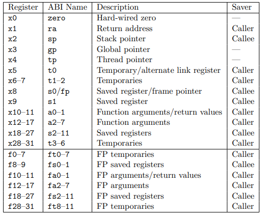

# References

## Git instructions (creating new branch)
- Switch to main before deleting
- Delete: `git branch -d <branch_name>`
- Make new branch:
  - `git checkout main`
  - `git pull`
  - `git branch <new_branch_name>`
- Rename branch:
  - `git checkout <branch_you_want_to_rename>`
  - `git branch -m <new_branch_name>`
- Branch from current main:
  - `git branch -b <branch_name>`

## RISC-V calling conventions

## Single-cycle design

## Cache (Two-way set associative)
