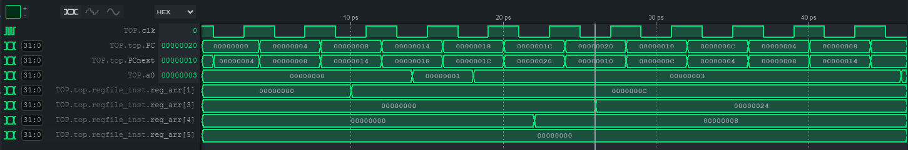
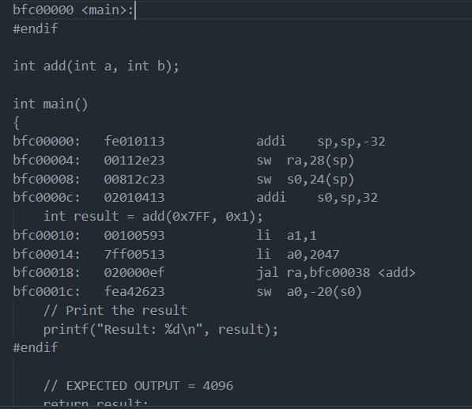
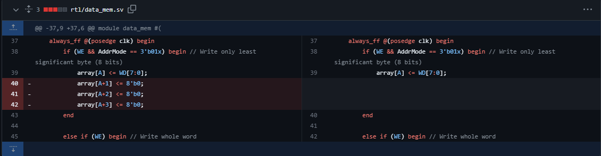

# Time Stamps

Kevin's logbook

## 16/11
  - Created program counter for lab4
  - Created the repo as the repo master
  - Created a Google Docs file for logging progress
## 22/11
  - Completed top module for lab4
  - Helped Noam with control unit
  - Noted down problems with other team member's modules when writing the top module
    - Lack of width declaration
    - Confusion of declaration between ports, interconnecting wire / signals
## 23/11
  - Managed pull requests and made sure everyone in team successfully merges their branch with the main branch
  - Debugging with team during lab session
  - Restructured the entire repo for the actual coursework
## 24/11
  - Debugging syntax errors provided by William's testbench regarding the lab4 design
    - alu.sv -- non-blocking assignments used in combinational logic, corrected to blocking assignments
    - alu.sv -- syntax error, semicolon written as comma
    - top.sv -- similar to alu.sv
    - regfile.sv -- "reg" used as variable declaration -> it is a keyword in Verilog-2005 and should not be used
    - controlunit.sv -- "ALUsrc" typo -> need to make sure declaration format is consistent
    - cpu.sv -- changing the module instant names
    - cpu.sv -- added more width declarations
    - instrmem.sv AND controlunit.sv -- changed to blocking
    - alu.sv -- default assignment for EQ to avoid latch inference
  - Note: potentially need to fix signextend.sv module
## 28/11
  - Added the machine code for lab4
  - Running the testbench to check for errors in code
  - Renaming files to follow underscore convention
  - instr_mem.sv
    - Note byte addressing method, setting data_width to 8 bits
## 29/11
  - Pipeline file added
  - Tried to figure out cache - think about how many bits you need in the two-way set and figure it out - draw a sketch or something
  - Some other minor changes
  - Added mux and data memory to rtl
  - Two-way set cache structure designed
## 30/11
  - Data memory testbench written, data memory debugged, all tests passed
  - F1 lights testbench written, testbench not fully debugged
## 2/12
  - Restructing the pipeline files into 4 flip flops
  - IF_ID (fetch to decode) flip flop completed, not tested
  - Mux pulled out from PC (previous poor design), top and PC updated
  - All other pipeline flip flops ports defined, but not completed
## 5-6/12 Midnight
  - Trying to debug why the "ret" was not working in the 019 test program (Crying in front of the waveforms at 2am in the morning)
  - Thought process:
    - It might be something to do with the JTA calculation or rd calculation
    - Read waveforms for the 019 test program which used a function call to test return (JALR)
    - Waveforms were too confusing
    - I should use F1 lights program to see what is happening to each register
    - Figured out the waveforms generated
    - Noticed that the JAL perfectly stored the return address in x1
    - Hypothesized that maybe the JALR instruction was working properly, but not for the special case "ret"
    - Added some instructions `addi    x4, x4, 8` and `jalr    x3, x4, 8` to test JALR
    - 
    - Waveforms show that JALR obtains the correct values for `x3 = PC + 4` and `PC_next = x4 + 8`
    - For the F1 lights code, I also tried an earlier return - I then realised there was an error with the addi instruction which loads 0xFF - after discussing with William next morning, it was an issue with the testbench - one of the Gtests expected 0x2000 load to a0 but it didn't run, so that caused an error, but since the last Gtest stops whenever 0xFF is loaded to a0 (it was a test for final value), it simply doesn't run past it as it has already met the expected behaviour of the test - I didn't notice that.
    - Also, I trialed and errored with the 019 code and realised by looking at the disassembly text that the program starts running inside the function defined as `int add` above `int main`, instead of starting at `int main`, as evidenced by the addresses in the disassembly text and the program counter waveform. I fixed this issue by declaring `int add` but not defining the function, instead defining it after `int main`. This results in:
      - 
      - where bfc00000 starts at the `main`, instead of `add`
    - After that, JALR worked fine. I noticed this error by looking at the waveform loop indefinitely within the `add` function addresses.
    - Further discussions in the morning allowed us to fix the testbenches and code which now runs perfectly.
## 6/12 Afternoon
  - Worked on the pipeline and hazard unit
  - Updated the `team.md`
  - For details, refer to the group meeting noted down in `team.md`
## 7/12 Midnight
  - Completed forwarding for RAW hazards
  - Started stalling for lw data dependency hazards
    - Added new ports for the `hazard unit`
    - Added a new `MemRead` from control unit for stalling
    - Haven't done: Implement a stall in `control unit` / other modules based on the `stall` signal from the `hazard unit`
## 7/12 Afternoon
  - Completed and verified lw data dependency hazard solution by stalling
## 8/12 Afternoon
  - Completed and verified all control hazards solution through flushing, working with William in room 404 in EEE building
## 9/12 and 10/12
  - This is a long story:
    - William tried to run the pipelined code on the vbuddy to see the PDF, however it was spitting random bits out instead of what we expected
    - There was obviously an issue with the code, so we conjured up a list of new tests in both `c` and `asm`
    - There was three main bugs that were discovered and solved with the combined effort of William and me:
      1. A double `lw` data dependency bug in the hazard unit
      2. A hazard unit bug with pointer dereferencing not properly
      3. Improper loading of data memory
    - How did we solve all three bugs?
    - **Observations**
      - Firstly, we noticed that the PDF was not right - William went back to tag v0.2.0, which was the single cycle, and found out that the single cycle was also not working - this was later found by me to be an issue with the data memory, which somehow managed to dodge all our tests
      - Secondly, William created a `linked-list test` which consistently failed on the pipeline
    - **Debugging bug #1**
      - Following these clues, I attempted to isolate the instruction (on Saturday). I found out there was an issue specifically with the instructions:
        `lw a5, -20(s0)`
        `lw a5, 4(a5)`
      - Specifically, the bug ONLY occured when in this specific format, where there was an initial load word into a register, and the same register would be used for both the access and destination address
      - In the end, William found out that he did not properly stall all the signals, causing this specific dependency hazard to occur.
    - **Debugging bug #2**
      - This was solved on Sunday afternoon. The `linked-list test` still failed, so I hopped into another Discord call with William
      - From a discussion with a friend from another team, I recalled that the other team had issues with synchronising his stalls and flushes
      - I realised that there could be potential issues with our stalling for solving the `lw data dependency hazard`
      - So I read the recommended textbook and realised that, while we wrote the conditions for stall correctly, we did not flush the pipeline register after the stalled stage to prevent bogus information from propagating forward
      - We implemented a flush specifically for this called `LWflush`, and the `linked-list test` passed successfully afterwards
    - **Debugging bug #3**
      - The PDF was still not working, and from the observations above as noted by William, I was highly certain it was a loading mem issue with either the `data_mem` or `instr_mem`
      - I double checked both files and found nothing wrong with their respective `readmemh` commands, but I noticed an inconsistency with the `addr_mode` function implemented
      - For the byte addressing mode, it seems to be setting all bytes other than the LS byte to 0 - however, it should not be doing that - it should be writing only the LS byte, but not set all the other bytes of the word to 0
      - The change below was implemented to remove this error and then the PDF program ran correctly
      - 
      - What is most surprising to me is that none of the tests written in both asm and C were able to catch this error, which shows holes in our testbenching skills which have room for improvement
## 11/12 and 12/12
  - Spent most of Monday (11/12) writing tests and working on debugging the byte overwriting error in the cache but didn't manage to isolate the specific error / instruction causing the bug (refer to `team.md`)
  - Made the direct-mapped cache more byte-addressing oriented with William and managed to make the cache work properly with our new design
## 13/12
  - Compiling the `team_statement` and re-organising the documentation in the repo
## 14/12
