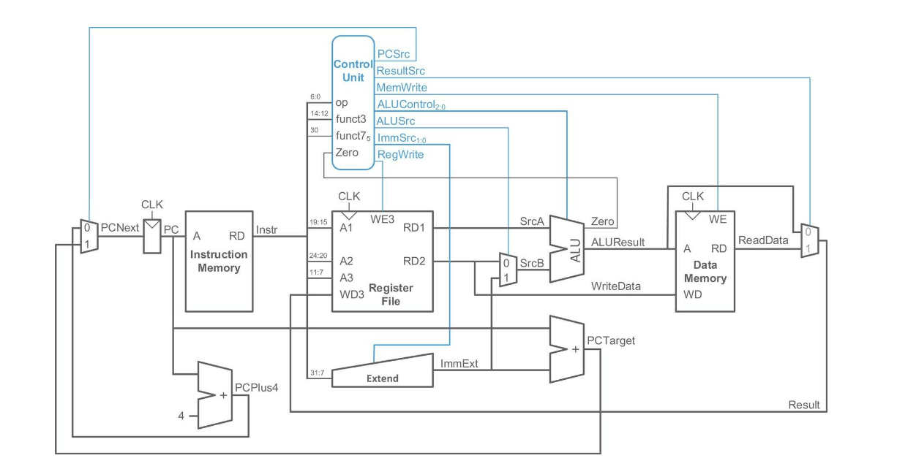
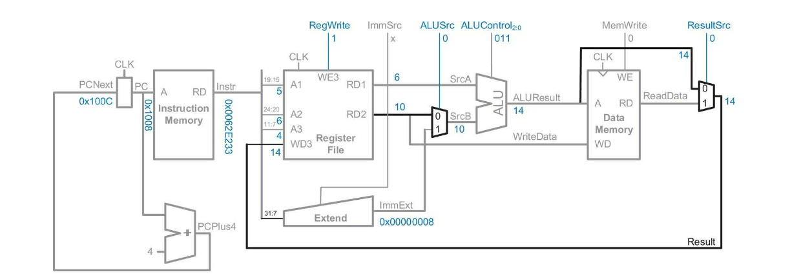
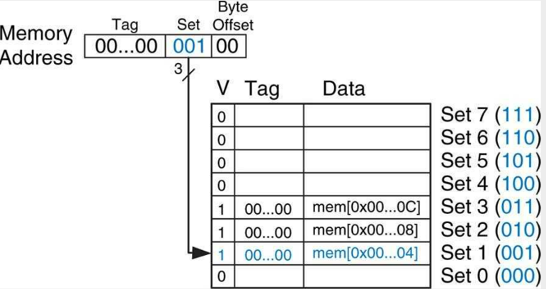
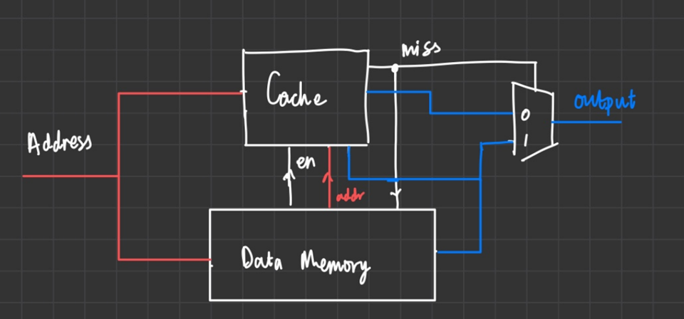
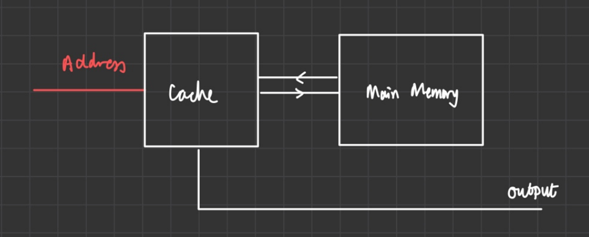
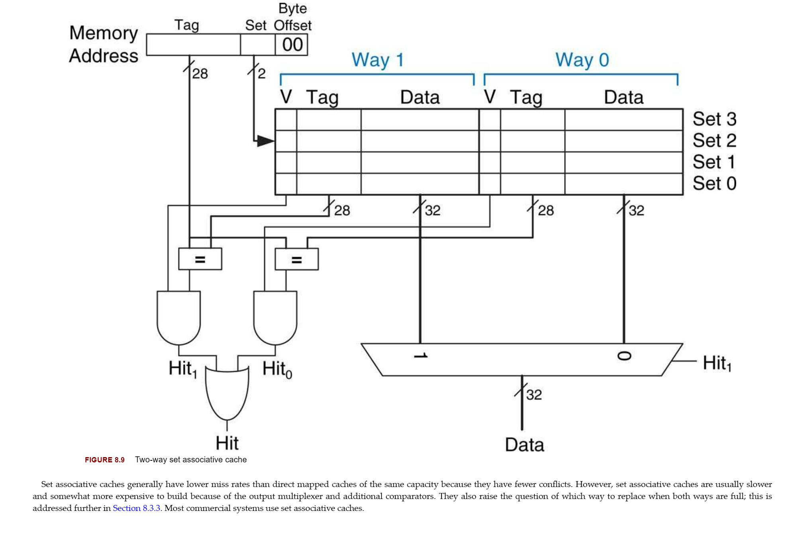

# Personal Statement: James Mitchell 
**Name:** James Mitchell  
**CID:** 02226128   
**Github Username:** JamieMitchell123

## Overview 
- [Summary](#summary)
- [Contributions](#contributions)
  - [Single Cycle](#single-cycle)
  - [Cache](#cache)
- [What I Have Leaned](#what-i-have-learned)
- [Mistakes I Made](#mistakes-i-made)
- [What I would do differently](#what-i-would-do-differently)

## Summary 

- I have worked on the single cycle and the cache of this processor designing many of the modules
    - lab 4/ Single Cycle modules
    -  Direct Mapped Cache
    -  Two-Way Associative Cache
- My Personal Logbook notes the process of all of this as well as highlights the work that I completed at different stages of the process
- I have included a concise reflection of my work here but more information on how each of the modules were designed and implemented can be found in the **team statement** as well as the **commits**

  
## Contributions
### Single Cycle 
[Single Cycle](../team_statements_sections/single_cycle.md)


In the single cycle design, I was reponsible for the design and implementation of the:
- [ALU](../../rtl/alu.sv)
- [Register file](../../rtl/regfile.sv)
- [Data memory](../../rtl/data_mem.sv)
- [Top File](../../rtl/top.sv)
- Restructuring
- Refactoring of Control Unit

  
  
  
---

#### ALU


For the initial design of the lab 4 ALU, only 3 operations were required **ADD**, **SUB**, **SLT**. However, in the single cycle to accomodate to all of the other instructions, **AND** and **OR** operations were also required.

```SV
  case(ALUctrl)
        3'b000:     ALUout = a + b;
        3'b001:     ALUout = a - b;
        3'b010:     ALUout = a & b;
        3'b011:     ALUout = a | b;
        3'b101:     ALUout = (a < b) ? 1 : 0;
        default:    ALUout = 0;   
    endcase
```

[ALU commit](https://github.com/booth-algo/RISC-V-T24/commit/ce83249d85a73ddd43959b309a3c04d96794e4a5)

---

#### Register File

The initial design of the single cycle required a 32 registers each of width 32 bits. 

[regfile](../../rtl/regfile.sv)

---

#### Data Memory

A new module **data_mem** was required for the single cycle design so Kevin and I. Designed, implemented and tested the module.

[Data memory commit](https://github.com/booth-algo/RISC-V-T24/commit/839a96757fc2fb19f1f6a06d36f8ff8e2de9464b)

[data_mem](../../rtl/data_mem.sv)

---

#### Restructuring

When changing the design to single cycle, putting the muxes inside the **Data Memory** and the **ALU** proved problematic. I pulled out the muxes into the top file to make it more readable and writing the top module easier.

---

#### Top Module 

For the single cycle design, I wrote the top module design, including the additional modules and wired appropriately.

--- 

### Cache
In the cache design, I was responsible for the design of the
- Direct Mapped Cache
- Two-Way Assosiative Cache
The final implementation was a split contribution between the team.


[Cache](../team_statements_sections/cache.md)
  
 ---
 
#### Direct Mapped Cache


The Direct Mapped Cache required a rewrite of the memroy module. From the Harris & Harris textbook, I designed a cacheline and memory addressing for the cache memory and then wrote the dm_cache.sv file with Noam for the direct mapped cache. 



However, after this initial design, it was spotted in the testing that the clock cycles were misaligned so all the members of the team rewrote the top memory module together for this design and implemented it.




[commit for **direct mapped** and **2-way cache**](https://github.com/booth-algo/RISC-V-T24/commit/69c44b4131087afad0459f1538536a7b8befd858) 

---

#### 2-Way Associative Cache


As I was designing the cache line and memory addressing for the direct mapped cache. I also wrote the code for the two-way associative cache based off an outline Kevin had provided. Noam and I finished this code using what we had learned from the direct mapped cache, the lectures and the textbook. The implementation of the **Replacement Policy** took time to research and Noam assisted with the syntax and logic behind the code. The code runs successfully passes both the F1 and PDF test benches along with the other 35 testbenches written however, the final implementaion due to time was never implemented in the final product. 

[LRU Commit](https://github.com/booth-algo/RISC-V-T24/commit/1e984468319cc8c3ddfdf2d63fa8c2554fc69d85)

[2-Way Asscoiative Cache code](../../cache/2way_cache.sv)

## What I Have Learned 
This project has been essential in my learning and development of this module. From the application of the theory in the coursework to the leaning how to manage time, delegate workload and work effectively in a team. This project has been a fantastic oppurtunity to create a CPU with a reduced version of what is used in industry as well as learning how optimisation is important and the implementation of this. The opportunity to learn and work with peers, I had not previously worked with was an opportunity to see how others work and learn from the strengths and weaknesses of the individual members in the team, the group's varying experience allowed for teaching of valuable methodology.

The scope of the project was time appropriate and the workload was difficult. The project allowed me to learn how to code as a team, with transcending the fear of editing or debugging code that one of my peers has written. My skills of debugging, writing readable code and communicating appropriately greatly improved over the scope of the project. This was my first experience with dealing with a project of this scale related to the CPU, so this was a great stepping stone for my future career and alligns to my goals going forward.

After taking a large portion of the workload related to cache, I have leanrt thoroughly through research the workings of the cache and its purpose and performance relating to conflicts of the CPU, some of which are covered in this project and will be used for future projects and has inspired me to move past the scope of this course.

## Mistakes I made 
I made a few mistakes in this project related to my management and skills learned. I regret not taking the opportunity to learning the workings of the testbenches early in the process. Learning this skill would've enabled more effective debugging, helping out the team more in this area.  

## What I Would Do Differently
In my opinion, the team worked exellently together and the dynamics of the team were effortless. I believe that the workload of the team was equally distributed and I am thankful for the work that my group have put into this project. If the group was to do this project again, I would ensure that we planned appropriately the design of each module before implementation to reduce time spent redesigning modules in the CPU and unneccessary time spent debugging. Finally, it was a difficult task to split work equally since an individual's contribution would impact everyone else's progress due to a lack of communication. 
