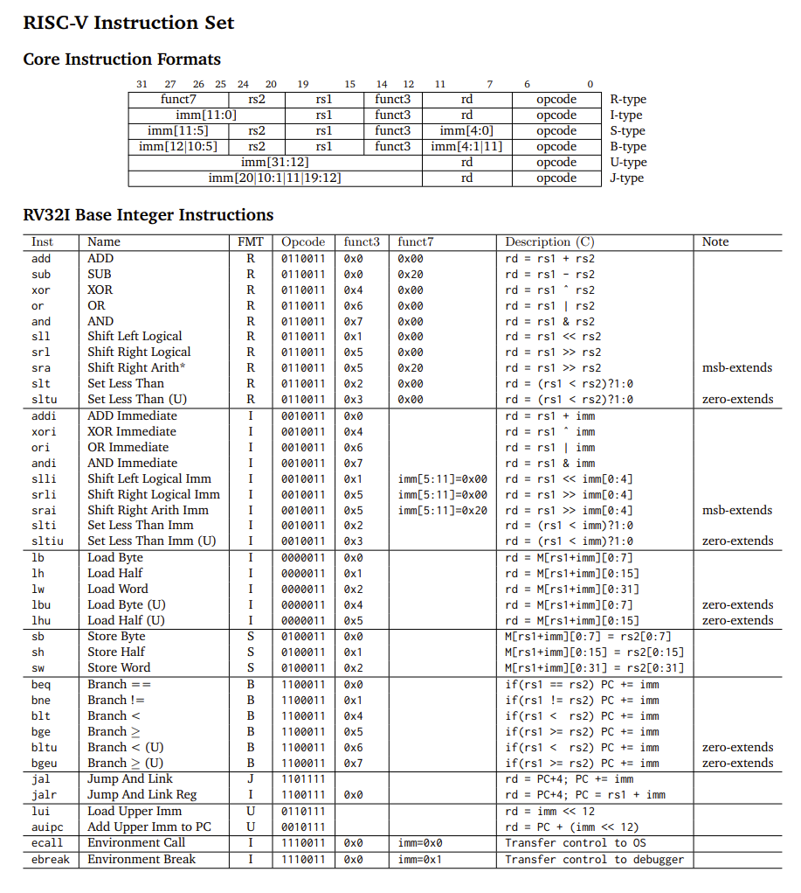

# Personal Statement: Noam Weitzman

**Name:** Noam Weitzman  
**CID:** 02049854   
**Github Username:** noamweitz

## Overview
- [Personal Statement: Noam Weitzman](#personal-statement-noam-weitzman)
  - [Overview](#overview)
  - [Summary of Contributions](#summary-of-contributions)
    - [Lab 4](#lab-4)
    - [Single Cycle CPU](#single-cycle-cpu)
    - [Cache](#cache) 
- [What I learned](#what-i-learned)
- [Mistakes I made](#mistakes-i-made)
- [What I would do differently](#what-i-would-do-differently)
    - [Cache](#cache)
  - [What I learned](#what-i-learned)
  - [Mistakes I made](#mistakes-i-made)
  - [What I would do differently](#what-i-would-do-differently)

## Summary of Contributions

### Lab 4

In the implementation of the simplified RISC-V for Lab 4, I was in charge of implementing:
- the **Instruction Memory** module (instr_mem.sv)
- the **Control Unit** module (control_unit.sv)
- the **Sign Extension** module (sign_extend.sv)
- the **testbench** for the **ALU** module

In the design of the Control Unit for Lab 4, I only had to implement a very limited number of instructions: 
- R-type instruction: *add* (rd = rs1 + rs2)
- I-type instruction: *addi* (rd = rs1 + imm)
- B-type instruction: *bne* (if (rs1 != rs2) PC += imm)  

The implementation of the instruction memory module was fairly simple, as it is just a RAM.  
The implementation of the sign extension module was a bit more complicated as I had to implement a different sign extension for different types of intructions.  

I also used this lab as an opportunity to write up another kind of testebenches by writing the ALU testbench: [ALU Testbench](/tb/test/alu_tb.cpp).

### Single Cycle CPU

Moving from Lab 4 to the whole Single Cycle implementation meant lots of modules had to be refactored as we needed to implement a whole lot more operations as seen in the RISC-V Instruction Set:

This meant effort had to be put into refactoring some modules, especially the **Control Unit** which turned out to be pretty tedious: [Control Unit module](../../rtl/control_unit.sv). Implementing the Control Unit involved a deep understanding of the overall design of the design to understand how operations impact the different signals: 
 Insert image of the whole architecture.

In order to correctly implement the Control Unit, I also got involved in writing testbenches, especially in asssembly language, which allowed me to test one specific RISC-V instruction. This turned out to be extremely useful for debugging: [Exemple of Assembly Testbench I implemented](../../tb/asm/006-lb-lbu-sb.s).

The refactoring of the **ALU** and **Sign Extension** modules was fairly straightforward, as we just needed to implement all types of instructions not in the Lab 4 design: [ALU module](../../rtl/alu.sv) and [Sign Extend](../../rtl/sign_extend.sv).

Finally, the **Data Memory** module also had to be refactored, because we had to implement byte specific instructions like lb and sb, allowing more specific control over bytes instead of just word control: [Data Memory](../../rtl/data_mem.sv).

### Cache

Implementing cache helped to increase overall computer performance by hindering *memory performance*. This was done by using the *temporal locality* property of memory. We started by implementing direct-mapped cache, where each set only holds one block of data: [Direct-Mapped Cache module](../../rtl/dm_cache.sv).

The implementation of direct-mapped cache was more complicated than expected, especially as we had started with a different, faulty design: 

In this design, 

This causes conflicts many memory addresses will map to the same set. This will result in a lower hit rate than we would have by implementing a two-way set associative cache. 

## What I learned
This project was extremely useful for me in enhancing my technical skills across various areas.

Firstly, it taught me how to properly use Git as a version control system to manage a coding project. I learned how to clone repositories, create and switch branches, push and pull, and merge branches. Git allowed our team to track and save all changes made to the project and overall collaborate more efficiently.

Secondly, it refined my skills in SystemVerilog. I learned how to write clean and well documented code that my teammates could understand easily. I also understood the importance of writing more modular code (more on that later). It also significantly improved my skills in debugging code, as there was a lot of debugging involved in each part of the project. 

Finally, it played a crucial role as my first actual coding project collaborating with a team. Not only did I get to put together and consolidate the theoretical knowledge we had accumulated in past labs, but it was also a great opportunity to work with teammates towards the same goal. It helped me to highlight any misunderstandings I may have had during lectures by applying it to an actual CPU implementation. I believe working as a team allowed me to gain experience in fields I was not familiar with, from teammates that had developed their knowledge through industry experience. I understood how important it was to identify and leverage the strengths and weaknessesses of people in a team. Lastly, the project honed my time planning abilities, underscoring the importance of efficient project management. 

## Mistakes I made

- I believe that the main mistake I did when writing code at first was not making it modular enough. An example of this is in the Control Unit, where I would specify the *opcode*, *funct3* and *funct7* bits instead of defining them somewhere and referring to them. This was probably the biggest mistake I made initially but improved with practice. This resulted in the code being more tedious to refactor.

- It took some time for me to understand how important it was to seek explanations from teammates to leverage their strengths and improve my weak spots.

- I had a misunderstanding of how byte addressing was handled compared to word addressing, leading to issues when debugging with the rest of the team. We also began with a wrong design of cache (as explained above in [cache](#cache) section).

These last mistakes taught me the importance of thorough understanding of the hardware we want to implement before proceeding with a faulty design. This highlighted the value of a clear and organised design and paying attention to details.

## What I would do differently

Overall, I believe we worked well as a team, and I am proud of the work we produced in such a short time. I feel that every team member contributed to the project and learned a lot. However, as mentioned above, if we were to collaborate again on a RISC-V CPU design, I would ensure a more thorough understanding of the overall hardware needed for the implementation. Finally, it was tricky to split tasks and assign them individually since an individual's contribution would impact everyone else's progress. Nonetheless, the team collaboration was great and flowed effortlessly.