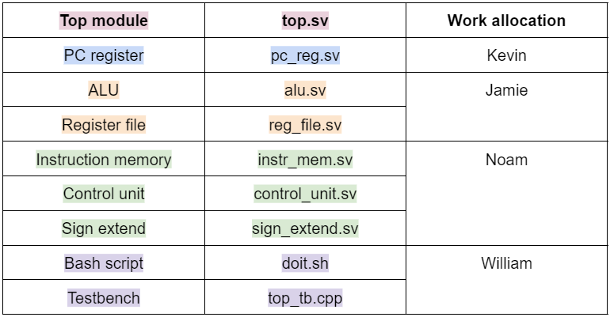

# Team Progress

This file will note down major meetups and breakdown the progress completed by those meetups.

- Lab meetup (16/11)
  - Discussed and allocated lab 4 parts to team members
    
    
  - Team goals:
    1. Lab 4 design
    2. Single cycle
    3. 5-stage pipeline
    4. Hazard detection
    5. Cache (2-way set associative) with prefetching

- Lab meetup (23/11)
  - Lab 4 parts were mostly completed before the lab meetup
  - Main issues discussed during meeting:
    - Should we group by making sub-top modules?
      - Not necessary
    - Note carefully the defining of wires and ports, there seems to be some confusion regarding those and also the internal and external interconnecting wires relative to each module.
    - Should we change module names to follow sth_sth.sv underscore standard?
      - Yes

- Group meetup (29/11)

- Group meeting (30/11)