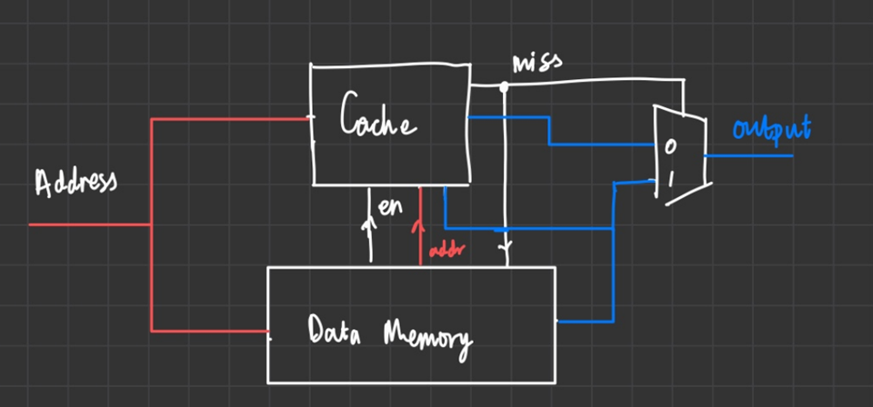
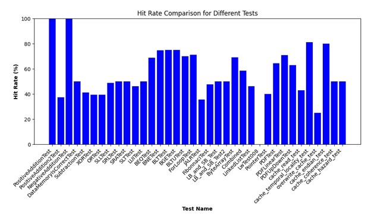

# Cached Version

| Table of Contents |
|-|
| [Introduction](#introduction) |
| [Design Specifications](#design-specifications) |
| [Direct Mapped Cache](#direct-mapped-cache) |
| [Two-Way Set Associative Cache](#two-way-set-associative-cache) |
| [Simulation and Testing](#simulation-and-testing) |
| [Conclusion and Further Improvements](#conclusion-and-further-improvements) |

## Introduction

Cache memory was introduced into this project, allowing us to have a faster type of memory with limited storage accessible to the processor.

We aimed to implement the concepts of "cache prefetching", which capitalised on the ideas of "temporal locality" and "spatial locality", which dictates which data memory to store in the cache based on what is most often fetched by the processor, and that its neighbouring memory addresses are more likely to be fetched.

At the time of writing, we have a complete working version of `direct-mapped cache`, and a working version of `two-way set associative cache`, but the replacement policy has not been completed nor verified.

## Design Specifications

Our initial cache design was implemented using the following schematic:



In this design, the `Address` signal is inputted to both the direct mapped cache and the data memory. If the address `insert signal` is mapped to one of the sets of data, the output signal `MISS` is set to low, and the data is read out of the cache through the multiplexer. If the `Address` signal does not map to a cache set, the output signal `MISS` = 1, and the output is read through the multiplexer.

However, with this implementation, an error, later discovered during implementation, occurred upon writing data from the `DATA MEMORY` to the `CACHE` due to misalignment of clock cycles. A new high-level configuration was required for the memory block. A more concise design was implemented, removing the multiplexer, accommodating the data to be read and written through the cache.


## Direct Mapped Cache

Firstly, a direct-mapped cache was designed, following the structure given in the Harris and Harris textbook, containing a cache line of 60 bits:
- 32 (least significant bits) assigned to **DATA** 
- 27 (next significant bits) assigned to **TAG**
- 1 (most significant bit) assigned to **VALID** 


This cache line maps to the memory addressing of the cache:
- 2 (least significant bits) assigned to **BYTE OFFSET** 
- 3 (next significant bits) assigned to **SET**
- 27 (most significant bits) assigned to **TAG**

**TAG** refers to the 27 most significant bits of the memory address which are used to identify the data stored within the direct-mapped memory. **VALID** is an identification bit used to equate whether the set of cache has been written to. **SET** bits are used to establish and index the cache storage in the memory. **BYTE OFFSET** bits are used to allow for byte and word addressing in the cache. Signals of this width were chosen to accommodate for word addressing and byte addressing. A memory address of 32 bits allows for both modes of addressing, controlled by a signal **ADDRMODE**. A set size of 8 allows for fast compact memory.

Finally an internal **HIT** signal was implemented, to ease the debugging, enhance testing and calculate the performance increase specified later in the results.

```SV
/* direct mapped cache 
        |  v  | tag  | data | 
        | [1] | [27] | [32] | 
    
        Memory address: (byte addressing) (32 bits)
            | tag | set | byte offset |
            | [27]| [3] |     [2]     |
            | a[31:5] | a[4:2] | a[1:0] |
            // is the number of cache registers = 32 so they are referenced like this?
*/
 
typedef struct packed {
    logic valid;
    logic [26:0] tag;
    logic [7:0] byte0;
    logic [7:0] byte1;
    logic [7:0] byte2;
    logic [7:0] byte3;
} cache_store;

cache_store cache [8];

logic [DATA_WIDTH-1:0] read_data;
logic [26:0] tag;
logic [2:0] set;
logic [1:0] byte_offset;
logic hit;
```

### [Read Logic](../../rtl/dm_cache.sv)

The data is read from cache if: 
  - the block is valid (**VALID** = 1)
  - the **TAG** matches the input **ADDRESS** signal

The 4 bytes specified in the data are then forwarded to the output signal **OUT**, and **HIT** is set to high.
Otherwise, the output signal is read from the **DATA MEMORY** through the signal read_data.

### [Write Logic](../../rtl/dm_cache.sv) 

```SV
always_ff @(posedge clk) begin
    if (write_en) begin
        // Pulls data in from sw/sb
        cache[set].valid <= 1;
        cache[set].tag <= addr[31:5];
        
        case (addr_mode)
            // Byte addressing
            `DATA_ADDR_MODE_B, `DATA_ADDR_MODE_BU: begin
                case (byte_offset)
                    2'b00:  cache[set].byte0 <= write_data[7:0];
                    2'b01:  cache[set].byte1 <= write_data[7:0];
                    2'b10:  cache[set].byte2 <= write_data[7:0];
                    2'b11:  cache[set].byte3 <= write_data[7:0];
                endcase
            end
            // Word addressing
            default: begin
                cache[set].byte0 <= write_data[7:0];
                cache[set].byte1 <= write_data[15:8];
                cache[set].byte2 <= write_data[23:16];
                cache[set].byte3 <= write_data[31:24];
            end
        endcase
    end
```

The write logic is split into two modes: byte and word addressing. Word addressing is the more general case in the testbenches written therefore this was set to default. 

In word addressing, the input signal, **write_data[]**, is written to the word, whereas in byte addressing, it is written to the specified byte.


## [Two-Way Set Associative Cache](../../rtl/way2cache.sv) 

For the design of the two-way associative cache, the following cache line was implemented:
```SV
/* two-way set associative cache (61 bits x2 so 122 total)
        |  v  |  u  |  tag |   data   |  v  |  u  | tag  |  data  |
        | [1] | [2] | [26] |   [32]   | [1] | [2] | [26] |  [32]  |
    
        // Two ways, and in each way there is 1 block

        Memory address: (byte addressing) (32 bits)
            | tag     | set    | byte offset |
            | [26]    | [4]    |      [2]    |
            | a[31:6] | a[5:2] | a[1:0]      |
*/
```
This cacheline contains two sets of data and contains **USE**, which is implemented to include a replacement policy to reduce the number of conflicts.


## Simulation and Testing

Extensive data analysis has been done on the cache. 

Several tests created in the `asm` folder were written for behavioural testing (hit / miss testing) for the cache. These tests were also useful in regression testing, which can be seen in the plotted bar chart below. A [Python Script](../../tb/analyse.py) was used to do data analysis on the hit / miss rate of the cache, and the below bar chart was plotted. 

The explanation for the work behind the data analysis is discussed in detail in [`testing.md`](../team_statement_sections/testing.md) - please have a read.

### Performance Analysis

Memory performance is tested by calculating the **HIT** and **MISS** rates for accessing data in the actual memory level when implementing instructions. The resulting **HIT** rates are represented in the following graph: 



Among the observed **HIT** rates for all conducted tests, a notable median value of **50.0%** emerges. This figure signifies that the main memory is accessed half the time, reflecting an enhanced memory performance. This metric is indicative of an efficient cache utilization, where a significant portion of requested data is found in the cache, reducing the need to access slower main memory.

## Conclusion and Further Improvements

Cache memory enhances computer performance. While direct-mapped cache showcased gains, it displayed conflicts in cases of overlapping addresses. Two-way set associative cache, although more efficient by resolving overlapping conflicts, was designed but not fully implemented.
