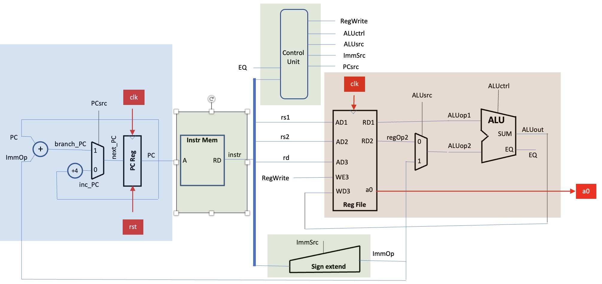

# Lab 4

| Table of Contents |
|-|
| [Introduction](#introduction) |
| [Design Specifications](#design-specifications) |

## Introduction

`Lab 4` kickstarted our journey with a basic structure and idea of how a CPU would work, and allowed us to have a first glimpse of using `git` to manage our workflow.

There is not much to be said about `lab 4`, and we would rather the reader put more time into reading the other sections, personal statements and logbooks to understand how set up the project to be rather successful completion reaching most of our goals.

## Design Specifications

There are some pros and cons we would like to note with our initial `lab 4`:

- A lot of time was spent on making a useful `testbench` instead of rushing onto `single-cycle` - looking back, this was a crucial step which allowed us to have smoother debugging sessions compared to other groups we talked to.

- However, there were several design flaws, including some hierarchal designs overlooked, including putting the `mux` logic into modules. These were later refactored, more information of this can be found in the `personal statements`.
