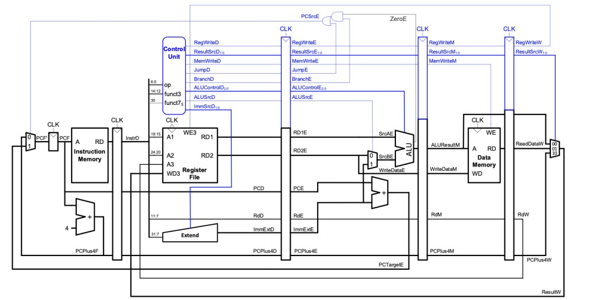
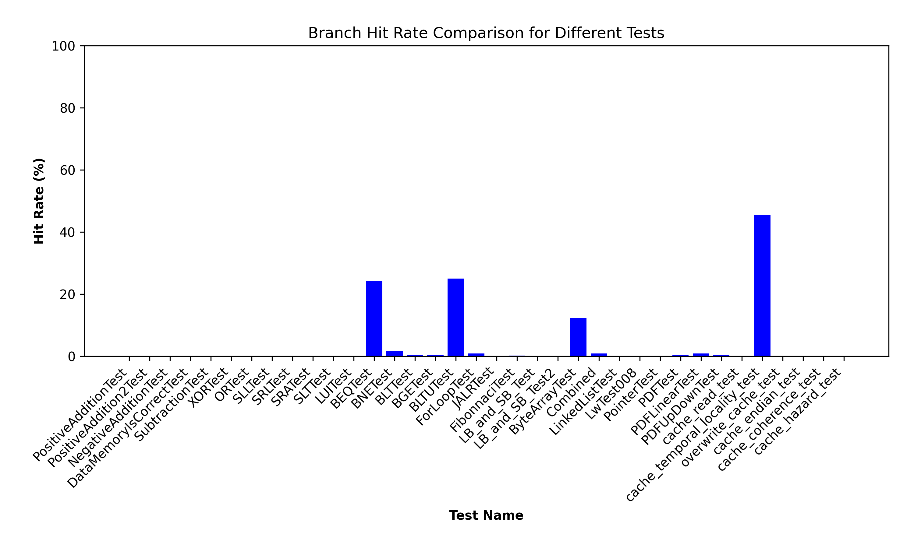

# Pipelined Version with Hazard Unit

| Table of Contents |
|-|
| [Introduction](#introduction) |
| [Basic Pipeline](#basic-pipeline) |
| [Data Hazards](#data-hazards) |
| [Control Hazards](#control-hazards) |
| [Simulation and Testing](#simulation-and-testing) |
| [Conclusion](#conclusion) |

## Introduction

## Design Specifications

Based on the suggested design in the lectures, we added four flip-flops to the design:
| Stage | Flip-flop SystemVerilog link |
|-|-|
| Fetch / Decode | [IF/ID](../../rtl/pipeline_IF_ID.sv) |
| Decode / Execute | [ID/EX](../../rtl/pipeline_ID_EX.sv) |
| Execute / Memory | [EX/MEM](../../rtl/pipeline_EX_MEM.sv) |
| Memory / Writeback | [MEM/WB](../../rtl/pipeline_MEM_WB.sv) |



The hard part was the `Hazard Unit`, where we had to implement three types of methods to combat different hazards, including `RAW dependency hazard`, `LW data dependency hazard`, `control hazards due to branch and jumping`.

Below is the overview of the `Hazard Unit`:


The details of the implementation are included below, and for notes of debugging processes, please refer to our [personal logbooks](../logbooks) and [personal statements](../personal_statements/).


## Data Hazards

### Read-after-write (RAW) Dependency Hazard - Forwarding

No drawing needed

### LW Data Dependency Hazard - Stalling

Diagram for stalling 

Signals for stalling

## Control Hazards - Stall and Flush

## Simulation and Testing

To make sure it works, instead of writing unit testbenches, we just used `regression testing` which ran multiple `c` and `asm` programs. This can be verified in the respective tag `v0.3.0` by running the testbench, which instructions are in the [`team statement`](../../README.md).

### Hazard Unit - Branch Hit Rate Analysis

We did some analysis on the behaviour of our hazard unit:



Looking at the graph, we see that most of the times our implementation for `stall-and-flushing` (for control hazards) incorrectly predicts the expected branching behaviour. Why is that?

### Case study: [For Loop Test](../../tb/c/018-for_loop.c)

Looking at the code and its respective disassembly text:

```c
for (int i = 0; i <= 100; ++i)
{
    ans += i;
}
```

```asm
    for (int i = 0; i <= 100; ++i)
bfc00010:	fe042423          	sw	zero,-24(s0)
bfc00014:	0200006f          	j	bfc00034 <main+0x34>
    {
        ans += i;
bfc00018:	fec42703          	lw	a4,-20(s0)
bfc0001c:	fe842783          	lw	a5,-24(s0)
bfc00020:	00f707b3          	add	a5,a4,a5
bfc00024:	fef42623          	sw	a5,-20(s0)
    for (int i = 0; i <= 100; ++i)
bfc00028:	fe842783          	lw	a5,-24(s0)
bfc0002c:	00178793          	addi	a5,a5,1
bfc00030:	fef42423          	sw	a5,-24(s0)
bfc00034:	fe842703          	lw	a4,-24(s0)
bfc00038:	06400793          	li	a5,100
bfc0003c:	fce7dee3          	bge	a5,a4,bfc00018 <main+0x18>
```

We see that most of the times, a branch occurs in the for loop (at `bfc0003c`). This is similar for most other programs, as seen in the bar chart above.

Since our control hazard's `flush and stall` assumes branch not taken, it mostly inaccurately predicts the branching behaviour, resulting in two clock cycles being lost.

A better implementation would be to use `branch prediction` to guess if branch will be taken, which would reduce lost clock cycles. However, we were short on time, and therefore this was not implemented.

## Conclusion

Building the pipeline prepared us well for the implementation of the cache, and allowed us to get a better grasp of the control and data signals occuring in the processor.

