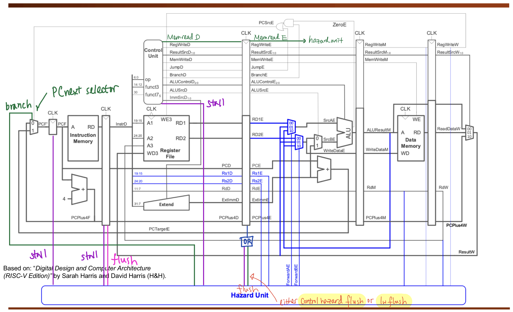

# Pipelined Version with Hazard Unit

| Table of Contents |
|-|
| [Introduction](#introduction) |
| [Design Specifications](#design-specifications) |
| [Data Hazards](#data-hazards) |
| [Control Hazards](#control-hazards) |
| [Simulation and Testing](#simulation-and-testing) |

## Introduction

## Design Specifications

Based on the suggested design in the lectures, we added four flip-flops to the design:
| Stage | Flip-flop SystemVerilog link |
|-|-|
| Fetch / Decode | [IF/ID](../../rtl/pipeline_IF_ID.sv) |
| Decode / Execute | [ID/EX](../../rtl/pipeline_ID_EX.sv) |
| Execute / Memory | [EX/MEM](../../rtl/pipeline_EX_MEM.sv) |
| Memory / Writeback | [MEM/WB](../../rtl/pipeline_MEM_WB.sv) | 


The implementation was quite smooth - it was simply a task of refactoring and connecting signals properly. Our solid testbench built up in previous sections allowed us to debug the implementation errors easily. 

The tough part was the `Hazard Unit`, where we had to implement three types of methods to combat different hazards, including `RAW dependency hazard`, `LW data dependency hazard`, `control hazards due to branch and jumping`.

Below is the overview of the `Hazard Unit` we implemented:


(Note: For the double flush at the bottom, the purple line should be a pink line)

Other than the implementation of forwarding as noted in the slides, there were some stall and flush signals added to some flip-flops and the control unit to overcome the aforementioned hazards. 

The details of the implementation are discussed below, and for notes of debugging processes, please refer to our [personal logbooks](../logbooks) and [personal statements](../personal_statements/).


## Data Hazards

### Read-after-write (RAW) Dependency Hazard - `Forwarding`


For the read-after-write dependency hazard, forwarding had to be implemented. We firstly initialised signals:

```sv
stall = 1'b0;
flush = 1'b0;
forwardA_E = 2'b00;
forwardB_E = 2'b00;
```

As for the logic, we simple check if the source register in Execute stage matches destination register of instruction in Memory or Writeback stage, using an if else statement, and forward result based on the following logic:

```sv
// forwardA_E
    // 00 : RD1_E : no forwarding
    // 01 : Result_W : forwarding from EX/MEM (after data memory)
    // 10 : ALUResult_M : forwarding from MEM/WB (after ALU)

if (RegWrite_M && (Rd_M != 0) && (Rd_M == Rs1_E)) begin
    forwardA_E = 2'b10;
end 
else if (RegWrite_W && (Rd_W != 0) && (Rd_W == Rs1_E)) begin
    forwardA_E = 2'b01;
end 
else begin
    forwardA_E = 2'b00;
end
```

Similar for signal `forwardB_E`, for the `Rs2` source register signal.


### LW Data Dependency Hazard - Stalling

Stalling was implemented to overcome the issue of a register being read after a word is loaded into it (hence named `load word data dependency hazard`). The diagrams below demonstrate our logic while implementing stalling:

| Diagram | Schematic | 
|-|-|
|  |  |

In the hazard unit, the logic was rather simple -- we ask the questions:
- Is the instruction in the EX stage a load word?
- Is the instruction in the EX stage using the same register as the instruction in the ID stage?

If both are true, then stall.

```sv
if (MemRead_E && ((Rd_E == Rs1_D) || (Rd_E == Rs2_D))) begin
            stall = 1'b1;
        end 
        else begin
            stall = 1'b0;
        end
```
(code snippet from the [`hazard unit`](../../rtl/hazard_unit.sv))

**Note: The `MemRead_E` was a new signal that had to be added to the overall design, which was propagated from an earlier stage to check if the instruction was a load word instruction. This can be seen in the diagram above, where:


In a debugging session later on, we realised that after a stage (and all previous stages) are stalled, the pipeline register directly after the stalled stage must be `flushed` to prevent useless information from propagating forward. 

Since this was after the creation of the `flush` signal specifically for the `control hazard`, we created an extra signal in the ID/EX pipeline flip-flop which flushes instructions **specifically** in the case of a `lw data dependency hazard`, as the `flushing` signal for the control hazard is linked to other modules which do not need to be flushed for the `lw data dependency` hazard.


```sv
 pipeline_ID_EX pipeline_ID_EX_inst (
        .clk(clk),
        .flush(flush),
        .LWflush(stall),    // LW is proprogated via stall. It will flush.
        .RD1_D(RD1_D),
        .RD2_D(RD2_D),
        ...
```
(code snippet from [`top.sv`](../../rtl/top.sv))

```sv
if (!flush && !LWflush) begin
            RegWrite_E <= RegWrite_D;
            MemWrite_E <= MemWrite_D;
            PCsrc_E <= PCsrc_D;
        end
        else begin
            RegWrite_E <= 0;
            MemWrite_E <= 0;
            PCsrc_E <= `PC_NEXT;
        end
```
(code snippet from [`ID/EX pipeline flip flop`](../../rtl/pipeline_ID_EX.sv))

## Control Hazards - Flushing

The last hazard to deal with was the control hazard created due to branching and jumping.


We assumed that branch isn't taken and let the pipeline fetch the next two instructions, and flush the two instructions if the branch is eventually taken. This is done by setting the control lines when they reach the EX stage.

In order to do so, we refactored the program counter to add a new component, [`pcnext_selector.sv`](../../rtl/pcnext_selector.sv), which feeds the signal `branch` to the `hazard unit`, and it sends a flush signal to the respective flip-flops.

```sv
always_comb begin        
        case (PCsrc)
            `PC_NEXT: begin
                out = in0;
                branch = 0;
            end              
            `PC_ALWAYS_BRANCH: begin
                out = in1;
                branch = 1;

            ......
```
(code snippet of [`pcnext_selector.sv`](../../rtl/pcnext_selector.sv))

| Branch signal | Flush signals |
|-|-|
|  |  |

(For a clearer picture, please refer to the [diagram](#design-specifications) above)

*Note: For further insights, please refer to the [branch hit rate analysis](#hazard-unit---branch-hit-rate-analysis) below.

## Simulation and Testing

To make sure it works, instead of writing unit testbenches, we just used `regression testing` which ran multiple `c` and `asm` programs. This can be verified in the respective tag `v0.3.0` by running the testbench, which instructions are in the [`team statement`](../../README.md).

### Hazard Unit - Branch Hit Rate Analysis

We did some analysis on the behaviour of our hazard unit:


Looking at the graph, we see that most of the times our implementation for `stall-and-flushing` (for control hazards) incorrectly predicts the expected branching behaviour. Why is that?

### Case study: [For Loop Test](../../tb/c/018-for_loop.c)

Looking at the code and its respective disassembly text:

```c
for (int i = 0; i <= 100; ++i)
{
    ans += i;
}
```

```asm
    for (int i = 0; i <= 100; ++i)
bfc00010:	fe042423          	sw	zero,-24(s0)
bfc00014:	0200006f          	j	bfc00034 <main+0x34>
    {
        ans += i;
bfc00018:	fec42703          	lw	a4,-20(s0)
bfc0001c:	fe842783          	lw	a5,-24(s0)
bfc00020:	00f707b3          	add	a5,a4,a5
bfc00024:	fef42623          	sw	a5,-20(s0)
    for (int i = 0; i <= 100; ++i)
bfc00028:	fe842783          	lw	a5,-24(s0)
bfc0002c:	00178793          	addi	a5,a5,1
bfc00030:	fef42423          	sw	a5,-24(s0)
bfc00034:	fe842703          	lw	a4,-24(s0)
bfc00038:	06400793          	li	a5,100
bfc0003c:	fce7dee3          	bge	a5,a4,bfc00018 <main+0x18>
```

We see that most of the times, a branch occurs in the for loop (at `bfc0003c`). This is similar for most other programs, as seen in the bar chart above.

Since our control hazard's `flush and stall` assumes branch not taken, it mostly inaccurately predicts the branching behaviour, resulting in two clock cycles being lost.

A better implementation would be to use `branch prediction` to guess if branch will be taken, which would reduce lost clock cycles. However, we were short on time, and therefore this was not implemented.
