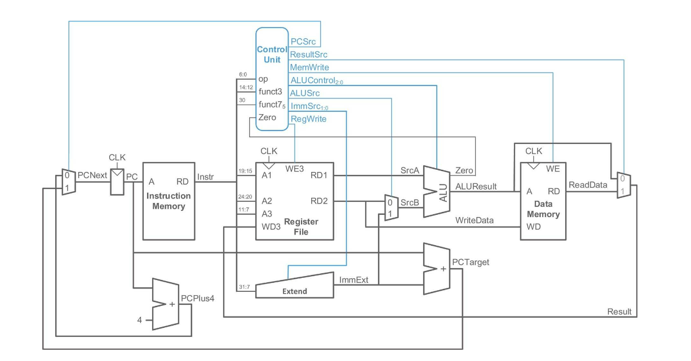

# Single Cycle Version

| Table of Contents |
|-|
| [Introduction](#introduction) |
| [Design Specifications](#design-specifications) |
| [Simulation and Testing](#simulation-and-testing) |
| [Conclusion](#conclusion) |

## Introduction

Building on `lab 4`, we quickly implemented the `single cycle version`. The main challenge was to get all of the base instruction set working properly, and the `control unit` was arguably the most significant part of the `single cycle` CPU, with most time being spent on debugging it.

## Design Specifications

Our design references the following schematic from the recommended textbook:



There weren't any specific modifications or modules added on to the schematic above. There were however several specific design choices that were made:

### Data memory

We noticed that while the loading of the `instruction memory` was offset in the bash scripts while loading, the `data memory` had to be offset correctly in SystemVerilog code.

| Memory map | Explanation |
|-|-|
|  | The memory map shows that the `data memory` goes from `0x01000` to `0x1FFFF`, which means we need $2^{17}$ addresses, hence the initialisation of our data array below.

```sv
// Define the data array
    // Each bit is 1 byte (8 bits) wide, with 2^17 bytes memory locations
    logic [MEM_WIDTH-1:0] array [2**17-1:0];

    initial begin
        $display("Loading data into data memory...");
        $readmemh("../rtl/data.hex", array, 17'h10000, 17'h1FFFF);
    end

    always_ff @* begin
        // Needs to be addressed in multiples of 4
        // 17 bits of addressing
        RD = {
            array[{A[16:2], 2'b11}],
            array[{A[16:2], 2'b10}], 
            array[{A[16:2], 2'b01}],    
            array[{A[16:2], 2'b00}] 
        };
    end
``` 

`AddrMode` was added to efficiently implement byte addressing for `lb` and `sb` instructions, which would also prove to be really useful in running the reference program [`pdf.s`](../../tb/asm/pdf.s).

```SV
// Read and write operations
always_ff @(posedge clk) begin
    if (WE && AddrMode == 3'b01x) begin // Write only least significant byte (8 bits)
        array[A] <= WD[7:0];
    end

    else if (WE) begin // Write whole word
        array[{A[16:2], 2'b00}] <= WD[7:0];
        array[{A[16:2], 2'b01}] <= WD[15:8];
        array[{A[16:2], 2'b10}] <= WD[23:16];
        array[{A[16:2], 2'b11}] <= WD[31:24];
    end
end
```

Extra note: There is a bug in `data memory` in the tag `v0.2.0` which was not discovered until a debugging session later on when working on `pipelining`. This is because for `byte addressing`, we wrote the 

### Control unit

Emphasis must also be placed on the `control unit`, which took the most time to debug for `single cycle`. 

For reusability and readability concerns, [`def.sv`](../../rtl/def.sv) was created to define all the `OPCODE`, `PCCODE`, etc.

| Control Unit | Instruction List |
|-|-|
|  |  |

While we swiftly implemented most of the basic instruction set, `JALR` was particularly hard to implement. We had troubles with the `ret` function not working as expected, and took some time to debug. The trouble can be seen in [`def.sv`](../../rtl/def.sv), where `JALR` gets its own `PC CODE`:

```sv
`define PC_NEXT                     3'b000
`define PC_ALWAYS_BRANCH            3'b001
`define PC_JALR                     3'b010
`define PC_INV_COND_BRANCH          3'b100
`define PC_COND_BRANCH              3'b101
```
(A snippet of `def.sv`)

## Simulation and Testing

For `single cycle`, we wrote [unit testbenches](../../tb/test) to ensure that all modules' behaviour are accurate and working, and to isolate errors to specific modules for easier debugging. This includes the:

| Component | Testbench Link |
|-|-|
| ALU | [alu_tb.cpp](../../tb/test/alu_tb.cpp) |
| Control unit | [control_unit_tb.cpp](../../tb/test/control_unit_tb.cpp) |
| Data memory | [data_mem_tb.cpp](../../tb/test/data_mem_tb.cpp) |
| Instruction memory | [instr_mem_tb.cpp](../../tb/test/instr_mem_tb.cpp) |
| MUX | [mux_tb.cpp](../../tb/test/mux_tb.cpp) |
| PC | [program_counter_tb.cpp](../../tb/test/control_unit_tb.cpp) |

The speciality of these testbenches is that it uses industry standard `GTests`, as stated in the [`testing.md`](testing.md). A snippet of one of the tests from the [`control unit testbench`](../../tb/test/control_unit_tb.cpp):

```cpp
TEST_F(ControlunitTestbench, MemWriteTest)
{   
    // MemWrite = 1: all store instructions
    // MemWrite = 0: else

    top->instr = OPCODE_S;
    top->eval();

    EXPECT_EQ(top->MemWrite, 1) << "Opcode = OPCODE_S";

    for (int opcode : { 
        OPCODE_I1, OPCODE_I2, OPCODE_I3, OPCODE_I4, 
        OPCODE_U1, OPCODE_U2, OPCODE_J, OPCODE_R, OPCODE_J
    }) {
        // Make sure MemWrite pulls DOWN instead of leave hanging
        top->instr = OPCODE_S;
        top->eval();

        top->instr = opcode;
        top->eval();

        EXPECT_EQ(top->MemWrite, 0) << "Opcode: " << std::bitset<7>(opcode);
    }
}
```
This allows us to check for the expected behaviour of each control / data path signal in each module. The testbench provides feedback in the terminal in the following format:


which definition can be found in the `doit.sh`.

The bash scripts [`compile.sh`](../../tb/compile.sh) and [`doit.sh`](../../tb/doit.sh) help compile and assemble [`C`](../../tb/c/) and [`asm`](../../tb/asm) tests in the testbench, run the tests, and creates `disassembly texts` for debugging purposes.

Every team member participated in writing these testbenches to ensure everyone gains experience of DevOps in hardware / firmware development. 

It is highly encouraged for the reader to take a look at the [`testing.md`](testing.md) to understand how the entire testbench is used.

## Conclusion

Overall, the `single cycle` version was a nice build-up, and honed our skills well to take on the more challenging parts of the RV32I processor design.