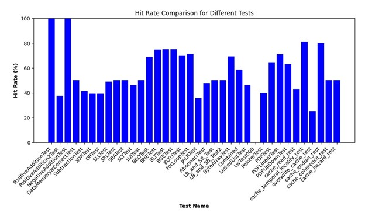

# Testing: Testbench, Scripts, CI*, Data Analysis

> “If it's not tested, it's broken” - Bruce Eckel

We believe that our test-driven development elevates and distinguishes our repo from other teams.

From the beginning, we used test-driven development. Sometimes the tests
were written before the components.

The [testbench](../../tb) was inspired by UVM testing methodology, in which every 
component undergoes extensive, random testing. However, it was decided that
a simpler, traditional testing approach will be used due to time constraints.

Before reading this section, it is *heavily* recommended to try out the 
testbench. Navigate to the [Quick Start](../../README.md#quick-start) for more 
information.

Implementations include:
  1. **CI pipeline** - GitHub Actions
  2. **Testbench and bash scripts** - GTests
  3. **Code Coverage** - LCOV
  4. **ASM and C tests**
  5. **Cache hit/miss test** - Data analysis

Note: to try the commands in this section, please execute the following command
from the project directory:

```bash
cd tb
```

\* CI = Continuous Integration

## CI pipeline - GitHub Actions

The [CI pipeline](../../.github/workflows/main.yml) automatically generates a 
pass or a fail on every push/merge into the remote git repository, notifying 
developers in case their changes anything. 

It is also an easy way for others to see how our code is tested.

## Testbench and bash scripts - GTests

Two types of testbenches were implemented:
  1. Unit testbenches
  2. [Integration testbenches](../../tb/test/top-instr_tb.cpp)

Unit testbenches were cover all the individual components.
Integration testbenches were useful for 
[regression testing](https://en.wikipedia.org/wiki/Regression_testing).

GTest was used as a framework due to it being an industry standard.

Bash scripts were preferred over makefiles as there was no real need for
caching the built versions of the CPU every time, since they are simpler
to read. More documentation is found in each file's header e.g. 
[`compile.sh`](../../tb/compile.sh).

## Code Coverage

Measuring code coverage allows us to find potentially untested pieces of code.
This turned out to be especially useful for the control unit.

Running a unit testbench generates a code coverage report using LCOV.
Give it a go:

```bash
./doit.sh test/alu_tb.cpp
```

Now check this [webpage](../../tb/logs/html/index.html) for code coverage (will
appear after the script is ran).

Here are the statistics for the entire testbench. 

| Test                      | Code Coverage (%) | Tests     |
| ------------------------- | ----------------- | --------- |
| alu_tb.cpp                | 100               | 10        |
| control_unit_tb.cpp       | 91.8              | 11        |
| data_mem_tb.cpp           | N/A*              | 3         |
| instr_mem_tb.cpp          | 100               | 2         |
| mux_tb.cpp                | 100               | 2         |
| program_counter_tb.cpp    | 100               | 3         |
| regfile_tb.cpp            | 93.3              | 4         |
| sign_extend_tb.cpp        | 50                | 6         |
| top-f1lights_tb.cpp       | N/A*              | 2         |
| **top-instr_tb.cpp**      | **N/A\***         | **36**    |
| top-lab4_tb.cpp           | N/A*              | 4         |
| top-pdf_tb.cpp            | N/A*              | 1         |


\* There was a segmentation error when running certain testbenches, therefore
data could not be collected.

## ASM and C test writing

Tests were written for specific modules and instructions.

 Some tests were particularly useful for debugging some hidden bugs, including 
[`022-combined.c`](../../tb/c/022-combined.c), 
[`c/023-linked_list.c`](../../tb/c/023-linked_list.c), which provided huge help 
when debugging [`data_mem.sv`](../../rtl/data_mem.sv) and 
[`instr_mem.sv`](../../rtl/instr_mem.sv).

C code can be disassembed into assembly, allowing us to trace instructions and
memory locations easily, which helped a lot especially after pipeline
implementation. Give it a go:

```bash
./compile.sh --input c/023-linked_list.c
```

Now check the disassembly [here](../../tb/c/023-linked_list.dis.txt) (will
appear after the script is ran).

These tests allows us to **isolate** bugs down to certain instructions / 
behaviour.

Another advantage of using C is that expected outputs can easily be checked.
Give it a go:

```bash
cd c
gcc -o program 023-linked_list.c
./program
```

Here's what you should get:

```
158
```

This is done through conditional compilation, allowing the RISC-V compiler to
ignore the line below, referenced from 
[`c/023-linked_list.c`](../../tb/c/023-linked_list.c).

```c
#if !defined(__riscv)
    printf("%d\n", ans);
#endif
```

## Cache hit / miss test - Data analysis

After debugging, the implementation of direct-mapped cache passed all written 
tests, but it wasn't clear whether it exhibited the correct behaviour. 

To check whether the cache hit / miss behaviour was accurate, data analysis 
was done using previous tests written in `asm` specifically for hit/miss.

**Case Study**: 
[`011-dm_cache_temp_locality.s`](../../tb/asm/011-dm_cache_temp_locality.s).

This is the assembly code referenced from Lecture 9. The expected hit rate (as
seen in slide 14 at the time of reference) is **80% (12/15)**. This was verified
as **81% (13/16)**, as the last reading came from our pipeline implementation. This 
can be verified on the graph below, also 
referenced in the cache section.



The reproduction is quite difficult and tedious, 
however full instructions are listed 
[here](../../docs/references/instructions.md#branchcache-hit-rate).

If you want to request further guidance, you can email me: <wh1022@ic.ac.uk>.
