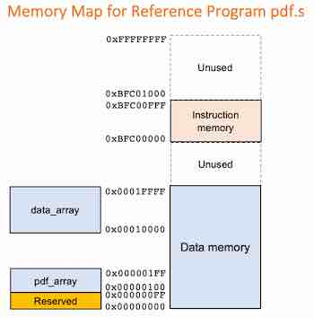

<center>

## EIE2 Instruction Set Architecture & Compiler (IAC)

---
## Reference Program for Team Project

**_Peter Cheung, V1.0 - 9 Dec 2022_**

---

</center>

This assembly language program, **_pdf.s_** is a common test for team's CPU design. The program reads 8-bit data 
from a data memory array starting at 0x10000 and produces a probability distribution function (PDF) in a pdf array at 0x100.

## New Memory Map

<p align="center">  </p><BR>
To run this program, you need to increase your data memory space according to the memory map shown here.  The data memory space from 0x00000000 to 0x0001FFF is used in the following ways:

* 0x00000000 to 0x000000FF  is 256 bytes reserved for other purpose (not used here)
* 0x00000100 to 0x000001FF  is 256 bytes to store the probability distribution function (pdf array)
* 0x00010000 to 0x0001FFFF  is a 65,536-bytes array that stores the data the PDF of which is to be calculated

The rest of the data memory space is not used by this program.
<br>

___

## How is probability distribution function calculated?
___

To find the PDF of an array of data (e.g. signals), we need to reserve a block of memory to store the distribution.  Each entry is a "bin", storing how many times a data value occurred.  Since the data is 8-bit wide, the range of data value is from 0 to 255.  We therefore only need an array of size 256.  

To start, the count in each bin of the data array must be initialised to zero. We then read the data one byte at a time. If a data value is v,  we increment by one the "frequency count" in bin base_address + v.  We stop building the PDF array if any bin reaches a count of 255.

---

## The Reference Program **_pdf.s_**
---

Here is the reference program with line number.


<p align="center">  </p><BR>

It consists of 4 segments:
1. The main program loop,
2. The init function,
3. The build function,
4. The display function.
   
There are a number of important issues to note:

*   Lines 1-4 are assembler directives. **.text** means what follows is a program section.  **.equ** defines symbolic constants.

*   Lines 5-10 are the main program which initialize the pdf array bin counts to zero, then build the pdf function, and finally go into an infinite loop that keep outputing the pdf array to a0, which can be displayed on Vbuddy in the testbench.
  
*   I have used pseudoinstructions throughout to make the program more readable.  For example, line 21
```brainfuck
    LI  a1, base_data
```
is translated to the real instruction:
```brainfuck
    LUI     a1, 0x10
```

The 32-bit constant **_base_data_** is 0x10000, which is larger than 12 bits allowed by I-type instructions.  Therefore, we need to use the LUI instruciton.  This requires the programmer to understand how the LUI instruction works. The LI pseudoinstruction hides such details from the programmable.  Of course, as a hardware architect, you NEED to know that this instruction is translated to a LUI instruction!

* To help you mapping all pseudoinstruction to real instructions, I have provided you with a Makefile in the reference folder, which not only assembles the pdf.s source code to a hex file ready to be loading into instruction memory, but also produces the assembly listing in a .asm file.

* To **make** everything, simply type the command:

```bash
    make reference
```

* Provided in the repo are four data files each contains 65,536 bytes of signal data. They are:
  1.  sine.mem - a sinewave signal.
  2.  triangle.mem - a triangular wave signal.
  3.  gaussian.mem - a noise signal with a gaussian distribution.
  4.  noisy.mem - a noisy sinewave signal.
   
* You can read any of these data into the data memory data_array at the base address 0x10000 with the SystemVerilog directive:

```Verilog
    $readmemh('xxxx.mem', data_array, 0x10000);
```
* This program has data or control hazards if run on a pipelined version of the RISC-V processor.  You must add NOP yourself to get round the hazards.

* You are free to modify the pdf.s code but you should tell me what you have done and why.

* Evidence of this program working would be the plot of the PDF on Vbuddy. This can be done by plotting the value of top->a0 AFTER the function which builds the distribution is finished.  Do not plot a0 value every cycle - this will take too long.
  